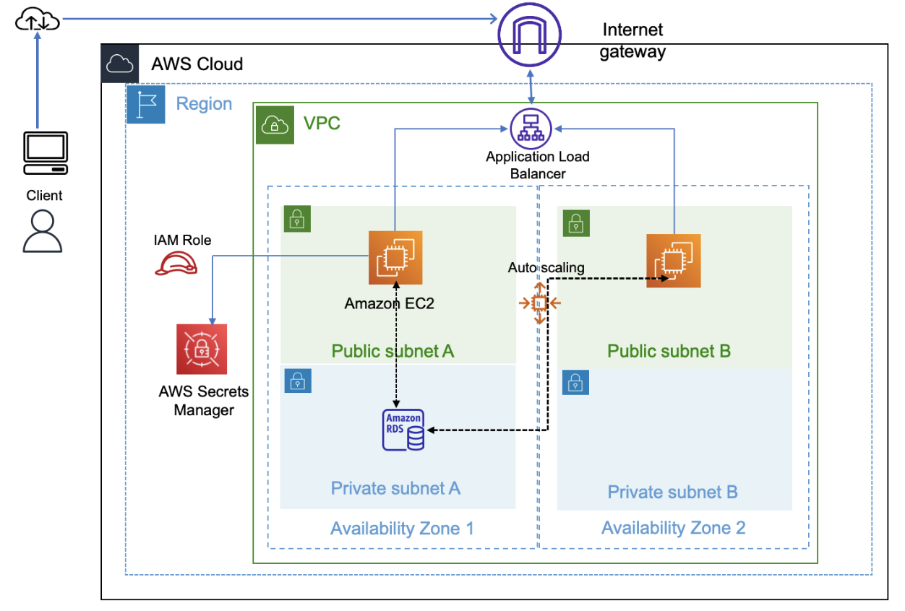
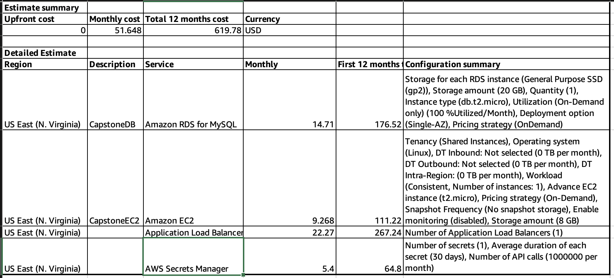
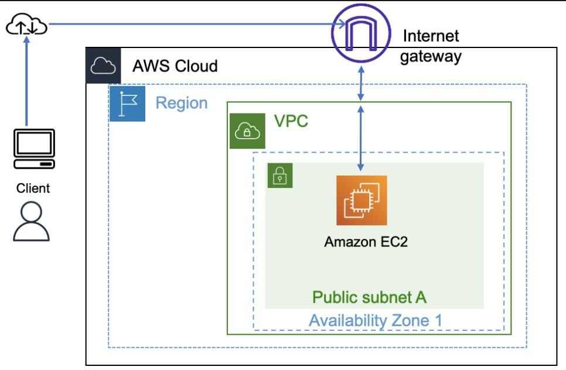
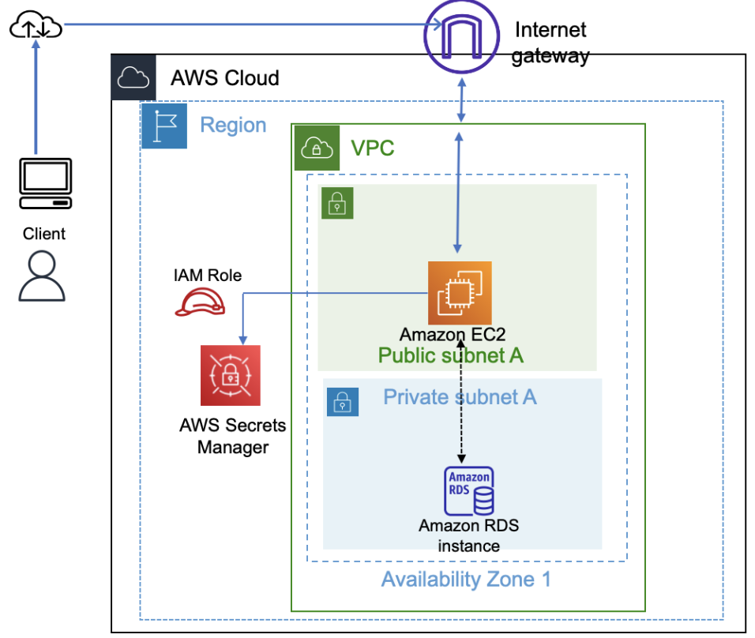

# Guia do Instrutor: Criação de um Aplicativo Web Dimensionável e Altamente Disponível

> ⚠️ **Importante:** este guia tem o objetivo de auxiliar o uso dos materiais do projeto. Use este guia como folha de respostas para realizar as tarefas mencionadas nas instruções do laboratório.

## Introdução ao projeto

*O projeto tem o objetivo de desafiar os alunos*. O tempo necessário para os alunos concluírem o projeto variará de acordo com o nível de habilidade do aluno. A previsão é de que o projeto levará de **8 a 12 horas** para ser concluído.

*O ambiente do laboratório é de longa duração*, ou seja, um aluno pode iniciar o laboratório em uma segunda-feira e continuar trabalhando nele na terça-feira ou em qualquer outro dia. Ao iniciar o ambiente do laboratório novamente, o aluno verá que tudo o que criou na conta da AWS ainda estará lá e, portanto, será possível continuar de onde parou.

## Como ensinar o projeto

É possível atribuir o projeto aos alunos sem gastar muito tempo com isso na aula. Porém, com essa abordagem, os alunos podem enfrentar dificuldades porque as seções das instruções do laboratório para os alunos não fornecem orientações detalhadas.

O projeto foi criado com o objetivo de pedir aos alunos que o concluam em vários dias ou semanas. As seções a seguir fornecem algumas sugestões de abordagens que podem ser utilizadas com o projeto.

> 💡 **Dica:** incentive os alunos a usarem capturas de telas ou gravações ao concluírem o trabalho. Esses ativos podem ser úteis para avaliar o aprendizado do aluno e os alunos podem utilizá-los em um portfólio de trabalho ao procurar emprego.

**Opção 1: abordagem de sala de aula**

*Adequada para alunos iniciantes*

Você pode ensinar o projeto por meio de uma abordagem guiada com várias sessões de verificação agendadas. Por exemplo:

- Atribuir as fases 1 e 2 como lição de casa.
- Na sessão de sala de aula seguinte, verifique:
  - Eles prepararam a estimativa de custo?
  - Eles criaram o diagrama da arquitetura? Eles prepararam uma apresentação com a solução proposta?
  - Eles criaram um aplicativo web funcional em uma instância do Amazon Elastic Compute Cloud (Amazon EC2)?
- Atribuir a fase 3. Na sessão de sala de aula seguinte, verifique:
  - Eles desacoplaram a arquitetura?
  - Eles criaram um banco de dados do Amazon Relational Database Service (Amazon RDS) em uma sub-rede separada?
- Atribuir a fase 4. Na sessão de sala de aula seguinte, verifique:
  - Eles criaram um balanceador de carga?
  - Eles configuraram o auto scaling?
  - A solução funciona na nova arquitetura?
  - Eles testaram o aplicativo com relação a carga?

**Opção 2: abordagem de grupo**

*Adequada quando a discussão e o estudo em grupo são incentivados*

É possível ensinar o projeto organizando os alunos em equipes.

- Peça aos alunos para concluírem o projeto por conta própria, mas incentive que compartilhem dicas com os membros da equipe.
- Se um aluno não puder progredir, solicite que ele entre em contato com os membros de sua equipe primeiro. Se a equipe não puder progredir, incentive-a a entrar em contato com você individualmente ou em um fórum para obter ajuda de outras pessoas.
- Conforme necessário, compartilhe dicas deste documento de forma seletiva.

**Opção 3: abordagem de poucas instruções ou nenhuma**

*Adequado para alunos avançados*

Você pode instruir os alunos avançados a determinarem sua própria abordagem. Eles podem usar uma arquitetura e pilha de tecnologia diferentes em vez de Java Script.

## Pré-requisitos do aluno

Este projeto requer entendimento dos principais serviços da AWS, como computação, armazenamento, redes e serviços de banco de dados. O projeto também requer conhecimento de práticas recomendadas de arquitetura, como alta disponibilidade, dimensionamento e segurança. ​Os alunos precisam ter concluído o curso Arquitetura em nuvem na AWS Academy para adquirir o conhecimento necessário.

Os alunos que concluíram o curso Princípios da nuvem na AWS Academy e estiverem inscritos no curso Arquitetura na nuvem na AWS Academy também podem tentar concluir este projeto com a ajuda de materiais do curso, laboratório de cursos e orientações do instrutor.

Ter conhecimento de alguma linguagem de programação, como Python ou JavaScript, é uma vantagem, mas não é obrigatório.

## Orientação aos alunos

Esta seção fornece detalhes de como concluir as etapas do projeto em que orientações detalhadas *não* são fornecidas ao aluno. As instruções do laboratório incluem links para recursos e referências a materiais do curso que podem ser úteis. Incentive os alunos a usarem estes recursos, e use este guia do instrutor para fornecer orientações adicionais quando necessário.

> 📝 **Observação:**
> - Este guia do instrutor fornece uma solução de exemplo para o cenário. No entanto, o guia não abrange todas as soluções possíveis.
> - As fases e tarefas no guia do instrutor são mapeadas para as fases e tarefas nas instruções do laboratório.

> ⚠️ **Importante:** a solução neste guia funcionará apenas se os trechos de código forem usados exatamente como na instrução, sem modificação.

### Fase 1: planejamento do design e estimativa de custo

Nesta fase, os alunos planejarão o design da solução e o custo estimado.

#### Tarefa 1: criar um diagrama da arquitetura

Nesta tarefa, os alunos criarão um diagrama da arquitetura ilustrando o que eles planejam criar. Serão fornecidos recursos para ajudar os alunos a criar o diagrama.

O diagrama da arquitetura a seguir mostra a solução proposta:



**Referências**

- [Ícones de arquitetura da AWS](https://aws.amazon.com/architecture/icons): este site fornece ferramentas para desenhar diagramas de arquitetura da AWS. Use a seu critério.
- [Diagramas de arquitetura de referência da AWS](https://aws.amazon.com/architecture/reference-architecture-diagrams): este site fornece diagramas de arquitetura de referência para diversos casos de uso.

#### Tarefa 2: desenvolvimento de uma estimativa de custo

Nesta tarefa, os alunos desenvolverão uma estimativa de custo para executar sua solução na região *us-east-1* por 12 meses.

A solução é a seguinte:

1. Acesse a [AWS Pricing Calculator](https://calculator.aws).
2. Clique em **Criar estimativa**.
3. Em **Escolher uma região**, escolha **Leste dos EUA (Norte da Virgínia)**.
4. Pesquise e configure os serviços que serão usados na solução. Configure cada serviço com base em como ele será usado.
5. Após a inclusão de todos os serviços necessários, selecione **Visualizar resumo** no canto inferior direito.
   
   A estimativa exibe o custo estimado inicial (se houver), o custo mensal e o custo total de 12 meses.

6. Revise as estimativas de custos de serviços individuais e ajuste a configuração para atingir um custo aproximado.
7. Exportar a estimativa:
   - Clique em **Exportar** e selecione exportar como um arquivo .csv ou .pdf.
   - Quando solicitado, selecione **OK** e baixe o arquivo.

Os alunos devem usar essa estimativa para ajustar a configuração da sua solução.

A imagem a seguir demonstra um exemplo de estimativa de custo. As estimativas de custo dependem dos serviços selecionados e de como eles são configurados. A estimativa de um aluno pode ser diferente deste exemplo.



> ⚠️ **Importante:** A AWS Pricing Calculator fornece apenas uma estimativa de suas taxas da AWS e não inclui qualquer imposto aplicável. As taxas reais dependem de vários fatores, incluindo o uso real dos serviços da AWS.

> 📝 **Observação:** peça que os alunos adicionem o diagrama da arquitetura e a estimativa de custo à apresentação para compartilhar com a classe. É possível avaliar esses materiais como parte da avaliação do trabalho deste projeto.

Nessa fase, os alunos criaram um diagrama da arquitetura e estimativa de custo para a solução proposta.

**Referências**

- [O que é AWS Pricing Calculator?](https://docs.aws.amazon.com/pricing-calculator/latest/userguide/what-is-pricing-calculator.html)
- [Modelo da apresentação em PowerPoint](https://aws-tc-largeobjects.s3.us-west-2.amazonaws.com/CUR-TF-200-ACCAP1-1-DEV/1-lab-capstone-project-1/s3/Academy_Lab_Projects_Showcase_template.pptx): este modelo é fornecido aos alunos. Personalize o modelo da apresentação conforme necessário e compartilhe-o com os alunos.

### Fase 2: criar um aplicativo web funcional básico

Nesta fase, os alunos começarão a criar a solução. Eles configurarão a rede virtual e criarão um servidor web.

O diagrama a seguir mostra diversos recursos da AWS usados para criar a arquitetura para esta fase:



#### Tarefa 1: criar uma rede virtual

Nesta tarefa, os alunos criarão a rede virtual para hospedar o aplicativo. A configuração de rede inclui uma nuvem privada virtual (VPC), um gateway de internet, uma sub-rede e rotas.

A solução é a seguinte:

1. Na barra de pesquisa, na parte superior do console de gerenciamento da AWS, pesquise e selecione `VPC`

2. Selecione **Criar VPC** e configure o seguinte:
   - **Recursos a serem criados:** selecione **Somente VPC**.
   - **Tag de nome** insira `CapstoneVPC`
   - **IPv4 CIDR:** insira `10.0.0.0/16`
   
   > 📝 **Observação**: o intervalo de CIDR fornecido para a configuração da VPC é apenas um exemplo. Os alunos podem usar um intervalo diferente conforme permitido pelo ambiente do laboratório.
   
   - Clique em **Criar VPC**.

3. Atualize as configurações da VPC:
   - Selecione **Ações** > **Editar configurações da VPC**.
   - Na seção **Configurações de DNS**, selecione **Habilitar nomes de host de DNS**.
   - Selecione **Salvar**.

4. No painel de navegação, clique em **Gateways da Internet** e configure o seguinte:
   - Clique em **Criar gateway da Internet**.
   - **Tag de nome:** insira `CapstoneIGW`
   - Clique em **Criar gateway da Internet**.

5. Anexar o gateway da Internet à VPC:
   - Selecione **Ações** > **Anexar à VPC**.
   - **VPCs disponíveis**: selecione **CapstoneVPC**.
   - Selecione **Associar gateway da Internet**.

6. No painel de navegação, clique em **Sub-redes** e configure o seguinte:
   - Selecione **Criar sub-rede**.
   - **ID da VPC:** selecione **CapstoneVPC**.
   - **Nome da sub-rede:** insira `Public Subnet 1`
   - **Zona de Disponibilidade:** da lista suspensa, escolha a primeira Zona de Disponibilidade.
   - **IPv4 CIDR block** (Bloco CIDR IPv4): insira `10.0.1.0/24`
   - Selecione **Criar sub-rede**.

7. No painel de navegação, clique em **Tabelas de rotas** e configure o seguinte:
   - Em **CapstoneVPC**, selecione o link **ID da tabela de rotas**.
   
   > 💡 **Dica:** procure *CapstoneVPC* na coluna **VPC**. Se o nome da VPC não estiver visível, ajuste a largura da coluna.
   
   - Na guia **Rotas**, no painel inferior, clique em **Editar rotas**.
   - Clique em **Adicionar rota** e adicione a seguinte rota:
     - **Destino:** insira `0.0.0.0/0`
     - **Alvo:** insira `Gateway da Internet` e clique em **CapstoneIGW**.
   - Clique em **Salvar alterações**.

8. No painel de navegação, clique em **Sub-redes** e configure o seguinte:
   - Selecione **Public Subnet 1** (Sub-rede pública 1).
   - Selecione **Ações** > **Editar configurações da sub-rede**.
   - Na seção **Configurações de atribuição automática de IP**, selecione **Enable auto-assign public IPv4 address** (Ativar a atribuição de endereço IPv4 público automaticamente).
   - Selecione **Salvar**.

Os recursos da rede virtual estão prontos. A próxima etapa é colocar uma máquina virtual na rede.

**Referência**

- Arquitetura na nuvem na AWS Academy – Laboratório: criar uma nuvem privada virtual

#### Tarefa 2: criar uma máquina virtual

Nesta tarefa, os alunos criarão uma instância do EC2 (máquina virtual) e instalarão um aplicativo web e um banco de dados na instância.

A solução é a seguinte:

1. Na barra de pesquisa, na parte superior do console de gerenciamento da AWS, pesquise e selecione `EC2`

2. Clique em **Executar instância** > **Executar instância** e configure o seguinte:

3. Na seção **Nome e tags**, em **Nome**, insira `CapstonePOC`

4. Na seção **Application and OS Images (Imagens do aplicativo e do sistema operacional)**, em **Quick Start (Início rápido)**, selecione **Ubuntu**.

5. Na seção **Par de chaves**, em **Nome de par de chaves**, insira **vockey**.

6. Na seção **Configurações de rede**, configure o seguinte:
   - Clique em **Editar**.
   - **VPC:** clique em **CapstoneVPC**.
   - **Atribuir IP público automaticamente:** selecione **Habilitar**.
   - **Firewall (grupos de segurança):** selecione **Criar grupo de segurança**.
   - **Nome do grupo de segurança:** insira `CapstoneAPPSG`
   - Selecione **Adicionar grupo de segurança**.
   - Mantenha a regra SSH existente e adicione duas novas regras com as seguintes configurações:
     - **New rule 1** (Nova regra 1): em **Tipo**, clique em **HTTP**. Em **Tipo de origem**, selecione **Qualquer lugar**.
       
       > 📝 **Observação:** Essa regra permite o tráfego de um navegador da web.
     
     - **New rule 2** (Nova regra): em **Tipo**, clique em **MYSQL/Aurora**. Em **Origem**, insira `10.0.0.0/16`
       
       > 📝 **Observação:** essa regra permite que os dados sejam exportados do banco de dados em uma tarefa posterior.

7. Expanda a seção **Detalhes avançados**.

8. Em **Dados do usuário**, copie e cole o seguinte código:

```bash
#!/bin/bash -xe

# Script de deploy para o Task Project com Nginx
echo "=== Iniciando deploy do Task Project ==="

# Atualizar sistema
apt update -y
apt install -y nginx mysql-server python3-pip python3-venv git pkg-config libmysqlclient-dev

# Criar usuário www-data se não existir
if ! id -u www-data > /dev/null 2>&1; then
    useradd -r -s /bin/false www-data
fi

# Criar diretórios necessários
mkdir -p /var/log/gunicorn
mkdir -p /var/run/gunicorn
chown www-data:www-data /var/log/gunicorn
chown www-data:www-data /var/run/gunicorn

# Clonar ou atualizar projeto
if [ ! -d "/opt/minicurso-wtads" ]; then
    cd /opt
    git clone https://github.com/andrealmeidaa/minicurso-wtads.git
else
    cd /opt/minicurso-wtads
    git pull origin main
fi

cd /opt/minicurso-wtads/task_project

# Criar ambiente virtual Python
python3 -m venv venv
source venv/bin/activate

# Instalar dependências Python no ambiente virtual
pip install -r requirements_simple.txt

# Configurar MySQL
systemctl start mysql
systemctl enable mysql

# Criar banco de dados e usuário
mysql -u root -e "CREATE DATABASE IF NOT EXISTS taskdb CHARACTER SET utf8mb4 COLLATE utf8mb4_unicode_ci;"
mysql -u root -e "CREATE USER IF NOT EXISTS 'taskapp'@'localhost' IDENTIFIED BY 'task@123';"
mysql -u root -e "GRANT ALL PRIVILEGES ON taskdb.* TO 'taskapp'@'localhost';"
mysql -u root -e "FLUSH PRIVILEGES;"

sed -i 's/.*bind-address.*/bind-address = 0.0.0.0/' /etc/mysql/mysql.conf.d/mysqld.cnf
systemctl enable mysql
service mysql restart

# Configurar arquivo .env
cat > .env << EOF
SECRET_KEY=$(venv/bin/python -c 'from django.core.management.utils import get_random_secret_key; print(get_random_secret_key())')
DEBUG=False
ALLOWED_HOSTS=*
DB_NAME=taskdb
DB_USER=taskapp
DB_PASSWORD=task@123
DB_HOST=localhost
DB_PORT=3306
EOF

# Executar migrações
venv/bin/python manage.py makemigrations
venv/bin/python manage.py migrate

# Coletar arquivos estáticos
venv/bin/python manage.py collectstatic --noinput

# Criar superusuário se não existir
venv/bin/python manage.py shell -c "
from django.contrib.auth import get_user_model
User = get_user_model()
if not User.objects.filter(username='admin').exists():
    User.objects.create_superuser('admin', 'admin@localhost', 'admin123')
    print('Superusuário criado: admin/admin123')
else:
    print('Superusuário já existe')
"

# Configurar permissões
chown -R www-data:www-data /opt/minicurso-wtads/task_project
chmod +x /opt/minicurso-wtads/task_project/gunicorn.conf.py

# Configurar systemd service
cp task_project.service /etc/systemd/system/
systemctl daemon-reload
systemctl enable task_project
systemctl start task_project

# Configurar Nginx
cp nginx.conf /etc/nginx/sites-available/task_project
ln -sf /etc/nginx/sites-available/task_project /etc/nginx/sites-enabled/
rm -f /etc/nginx/sites-enabled/default

# Testar configuração do Nginx
nginx -t

# Reiniciar serviços
systemctl restart nginx
systemctl restart task_project

# Verificar status
echo "=== Status dos serviços ==="
systemctl status mysql --no-pager -l
systemctl status task_project --no-pager -l
systemctl status nginx --no-pager -l

echo "=== Deploy concluído! ==="
echo "Aplicação disponível em: http://$(curl -s http://169.254.169.254/latest/meta-data/public-ipv4)"
echo "Admin: http://$(curl -s http://169.254.169.254/latest/meta-data/public-ipv4)/admin"
echo "Usuário admin: admin"
echo "Senha admin: admin123"

```

> ⚠️ **Importante:** verifique o formato do script depois de copiá-lo para o campo de dados do usuário. Se as linhas de código parecerem quebradas, tente copiar o código do arquivo [SolutionCodePOC](https://aws-tc-largeobjects.s3.us-west-2.amazonaws.com/CUR-TF-200-ACCAP1-1-DEV/1-lab-capstone-project-1/s3/UserdataScript-phase-2.sh).

> 📝 **Observação:** esse script instalará o Node.js, o aluno registrará o aplicativo (site, JavaScript, CSS e outros arquivos) e o banco de dados MySQL na instância do EC2.

9. Mantenha os valores padrão para todas as outras configurações e selecione **Executar instância**.

> ⚠️ **Importante:** antes de ir para a próxima tarefa, verifique se a instância está no estado *Running* (Executando) e se a coluna **Status check** (Verificação de status) diz "2/2 checks passed" (2/2 verificações aprovadas). Isso levará alguns minutos.

#### Tarefa 3: testar a implantação

Nesta tarefa, os alunos testarão o aplicativo implantado para garantir que ele pode ser acessado e está funcionando.

A solução é a seguinte:

1. Para testar o aplicativo web, acesse-o pela internet usando o **Endereço IPv4 público** ou **DNS do IPv4 público** da instância CapstonePOC.

   **Observação:** use http (em vez de https) ao acessar o aplicativo web no navegador.

2. Realize algumas tarefas, como adicionar novos registros de alunos, editar registros e excluir registros. Mantenha ao menos um registro no banco de dados para que você tenha dados para migrar para um novo banco de dados em uma tarefa posterior.

Os alunos agora têm um site funcional que executa em uma instância do EC2.

A arquitetura que os alunos criaram até agora foi fácil de criar, com poucos componentes e baixo custo. Essa abordagem é adequada para uma prova de conceito (POC). No entanto, uma arquitetura monolítica, em que todos os componentes existem em uma única máquina virtual, não é flexível e é difícil de dimensionar. Na próxima fase, os alunos separarão as diversas camadas.

### Fase 3: desacoplamento dos componentes do aplicativo

Após a criação da POC em uma única máquina virtual e de seu funcionamento esperado, os alunos prosseguirão para o próximo nível do projeto para desacoplar as camadas do aplicativo e banco de dados. Separar as camadas fornece flexibilidade à arquitetura e a habilidade de dimensionar cada camada de forma independente. A segurança também pode ser implantada para as duas camadas a fim de melhorar o procedimento de segurança.

O diagrama a seguir demonstra a possível aparência da arquitetura após o desacoplamento dos componentes.



#### Tarefa 1: alterar a configuração da VPC

Nesta tarefa, os alunos modificarão a configuração de rede para hospedar um banco de dados do Amazon RDS separada do aplicativo web.

A solução é a seguinte:

1. Na barra de pesquisa, na parte superior do console de gerenciamento da AWS, pesquise e selecione `VPC`

2. Crie uma sub-rede *privada* na CapstoneVPC:
   - No painel de navegação, selecione **Sub-redes**.
   - Selecione **Criar sub-rede**.
   - **ID da VPC:** selecione **CapstoneVPC**.
   - **Nome da sub-rede:** insira `Private Subnet 1`
   - **Zona de Disponibilidade:** escolha a mesma Zona de Disponibilidade usada na instância do EC2.
   - **IPv4 CIDR block** (Bloco CIDR IPv4): insira `10.0.2.0/24`
   - Selecione **Criar sub-rede**.

Agora, os alunos precisarão criar uma tabela de rota personalizada. Eles associarão novas sub-redes à nova tabela de rota para tornar as sub-redes privadas e acessíveis apenas dentro da VPC.

2. Criar uma tabela de rota:
   - No painel de navegação, selecione **Tabelas de rotas**.
   - Clique em **Criar tabela de rotas**.
   - **Nome:** insira `CapstonePrivateRT`
   - **VPC:** clique em **CapstoneVPC**.
   - Clique em **Criar tabela de rotas**.
   - Na guia **Rotas**, confirme se *apenas uma* rota está listada e que as configurações são as seguintes:
     - **Destino** é **10.0.0.0/16**.
     - **Alvo** é **local**.

Agora, os alunos precisarão criar outra sub-rede *privada* para oferecer suporte ao novo banco de dados.

3. Crie outra sub-rede *privada* na CapstoneVPC:
   - No painel de navegação, selecione **Sub-redes**.
   - Selecione **Criar sub-rede**.
   - **ID da VPC:** selecione **CapstoneVPC**
   - **Nome da sub-rede:** insira `Private Subnet 2`
   - **Zona de Disponibilidade:** selecione uma Zona de Disponibilidade *diferente* de onde estão a sub-rede pública 1 e a instância da CapstonePOC.
   - **IPv4 CIDR block** (Bloco CIDR IPv4): insira `10.0.4.0/24`
   - Selecione **Criar sub-rede**.

4. Associe uma tabela de rota para as duas sub-redes privadas:
   - Na lista de sub-redes, selecione o link **ID da sub-rede** para a sub-rede privada 2.
   - Clique na guia **Tabela de rotas**.
   - Selecione **Editar associação da tabela de rotas**.
   - Em **ID da tabela de rotas**, clique em **CapstonePrivateRT**.
   - Selecione **Salvar**.
   - Repita essas etapas para associar o CapstonePrivateRT à sub-rede privada 1.

A VPC e a rede agora estão reconfiguradas com sub-redes privadas em duas Zonas de Disponibilidade para hospedar o banco de dados do Amazon RDS.

**Referência**

- Arquitetura na nuvem na AWS Academy – Laboratório: criar uma nuvem privada virtual

#### Tarefa 2: criar e configurar o banco de dados do Amazon RDS

Nesta tarefa, os alunos configurarão o banco de dados do Amazon RDS e criarão um grupo de segurança (firewall) para ele.

A solução é a seguinte:

1. Criar um grupo de segurança para o banco de dados:
   - Na barra de pesquisa, na parte superior do console de gerenciamento da AWS, pesquise e selecione `EC2`
   - No painel de navegação, selecione **Grupos de segurança**.
   - Selecione **Criar grupo de segurança** e faça a seguinte configuração:
     - **Nome do grupo de segurança**: insira `CapstoneDBSG`
     - **Descrição:** insira `Security group for database`
     - **VPC:** comece a digitar `CapstoneVPC` e selecione-a quando aparecer.
     - Na seção **Regras de entrada**, selecione **Adicionar regra** e configure as opções a seguir:
       - **Tipo:** selecione **MYSQL/Aurora**.
       - **Origem:** insira `10.0.0.0/16` no campo à direita de **Personalizado**.
     - Selecione **Criar grupo de segurança**.

2. Criar um banco de dados do Amazon RDS:
   - Na barra de pesquisa, na parte superior do console de gerenciamento da AWS, pesquise e selecione `RDS`
   - Selecione **Criar banco de dados**.
   - Na seção **Opções do mecanismo**, configure o seguinte:
     - **Tipo de mecanismo:** selecione **MySQL**.
     - **Versão do mecanismo**: mantenha o padrão.
   - Na seção **Modelos**, selecione **Nível gratuito**.
   - Na seção **Configurações**, configure o seguinte:
     - **Identificador da instância de banco de dados:** insira `CapstoneDB`
     - **Nome do usuário mestre:** insira `nodeapp`
     - **Master password** (Senha principal): insira `student12` e digite a mesma coisa no próximo campo para confirmar a senha.
   - Na seção **Configuração da instância**, em **Classe da instância do banco de dados**, mantenha o padrão de **db.t3.micro**.
   - Na seção **Armazenamento**, em **Armazenamento alocado**, insira `20` GiB.
   - Na seção **Conectividade**, configure o seguinte:
     - **Nuvem privada virtual (VPC):** selecione **CapstoneVPC**.
     - **Acesso público:** selecione **Não**.
     - **Grupo de segurança da VPC:** deixe marcado **Escolher existente**.
     - **Grupos de segurança da VPC existentes:** remova o grupo **padrão**. *Adicione* o grupo **CapstoneDBSG**.
     - **Zona de Disponibilidade:** da lista suspensa, escolha a primeira Zona de Disponibilidade.
   - Na seção **Monitoramento**, desmarque **Habilitar monitoramento avançado**, caso esteja selecionado.
   - Expanda a seção **Configuração adicional** e, em **Nome do banco de dados inicial**, digite `STUDENTS`
   
   > 📝 **Observação:** mantenha todos os outros valores como padrão. Você pode modificar alguns dos parâmetros, conforme necessário, após a criação do banco de dados.
   
   - Selecione **Criar banco de dados**.

> ⚠️ **Importante:** antes de ir para a próxima etapa, confirme que o status do banco de dados é *Available* (Disponível). Isso levará alguns minutos.

3. Quando o banco de dados estiver disponível, encontre e registre o endpoint do banco de dados do RDS:
   - Da lista do banco de dados, selecione o link **Identificador do banco de dados** para **capstonedb**.
   - Na guia **Segurança e conexão**, em **Endpoint e porta**, registre o valor do **Endpoint** para uso posterior.

**Referência**

- Laboratório Princípios da nuvem na AWS Academy: criar um servidor de banco de dados e interagir com o banco de dados usando um aplicativo

#### Tarefa 3: configurar o ambiente de desenvolvimento

Nesta tarefa, os alunos criam um ambiente de desenvolvimento do AWS Cloud9 para realizar operações da AWS Command Line Interface (AWS CLI).

A solução é a seguinte:

1. Na barra de pesquisa, na parte superior do console de gerenciamento da AWS, pesquise e selecione `Cloud9`

2. Selecione **Criar ambiente** e configure o seguinte:
   - **Nome:** insira `CapstoneIDE`
   - **Tipo de ambiente:** selecione **New EC2 instance** (Nova instância do EC2).
   - **Tipo de instância:** selecione **t2.micro**.
   - Na seção **Configurações de rede**, em **Conexão**, selecione **Secure Shell (SSH)**.
   - Expanda a seção **Configurações da VPC** e defina as seguintes configurações:
     - **Amazon Virtual Private Cloud (VPC):** selecione **CapstoneVPC**.
     - **Sub-rede:** selecione **Public Subnet 1** (Sub-rede pública 1).
   - Mantenha todas as configurações padrão.
   - Selecione **Criar**.

> ⚠️ **Importante:** antes de ir para a próxima tarefa, espere até que o ambiente do AWS Cloud9 seja criado. Isso levará alguns minutos.

Os alunos devem usar esse ambiente de desenvolvimento do AWS Cloud9 para realizar tarefas que requerem a execução de comandos da AWS CLI.

**Referência**

- [Criar o ambiente do Cloud9](https://docs.aws.amazon.com/cloud9/latest/user-guide/create-environment-main.html)

#### Tarefa 4: provisionar o Secrets Manager

Nesta tarefa, os alunos provisionarão segredos no AWS Secrets Manager para armazenar credenciais do banco de dados. O aplicativo web usará essas credenciais para se comunicar com a instância do banco de dados do RDS.

A solução é a seguinte:

1. No console do AWS Cloud9, abra o ambiente CapstoneIDE.

2. No terminal, para criar segredos, execute o comando a seguir. Substitua *<rds-endpoint>* pelo endpoint do banco de dados CapstoneDB RDS:

> ⚠️ **Importante:** use os mesmos nomes de recurso fornecidos nas instruções. Não os modifique.

> 📝 **Observação:** se o comando parecer estar quebrado, tente copiar o comando de *Script-1* do arquivo [AWS Cloud9 Scripts](https://aws-tc-largeobjects.s3.us-west-2.amazonaws.com/CUR-TF-200-ACCAP1-1-DEV/1-lab-capstone-project-1/s3/cloud9-scripts.yml).

```bash
#Replace <rds-endpoint> with the endpoint from the RDS database (CapstoneDB)
#Only replace the values mentioned and keep others 'as is'

aws secretsmanager create-secret \
    --name Mydbsecret \
    --description "Database secret for web app" \
    --secret-string "{\"user\":\"nodeapp\",\"password\":\"student12\",\"host\":\"<rds-endpoint>\",\"db\":\"STUDENTS\"}"
```

> 📝 **Observação:**
> - O segredo criado nesta etapa armazena as credenciais do banco de dados que o aplicativo web usará por meio do perfil do AWS Identity and Access Management (IAM), chamado *LabRole*. Isso melhora o procedimento de segurança por não armazenar credenciais no aplicativo ou no banco de dados.
> - *LabRole* foi criado previamente no ambiente do laboratório. O perfil facilita interações seguras entre serviços da AWS. O perfil já inclui as políticas de permissões apropriadas.

**Referência:**

- "create-secret" (criar segredo) na [Referência de comandos da AWS CLI para AWS Secrets Manager](https://docs.aws.amazon.com/cli/latest/reference/secretsmanager/create-secret.html)

#### Tarefa 5: provisionar uma nova instância para o servidor web

Nesta tarefa, os alunos provisionarão uma nova instância do EC2 na sub-rede *pública* e instalarão o aplicativo web.

A solução é a seguinte:

1. Na barra de pesquisa, na parte superior do console de gerenciamento da AWS, pesquise e selecione `EC2`

2. Clique em **Executar instância** > **Executar instância** e configure o seguinte:
   - Na seção **Nome e tags**, em **Nome**, insira `CapstoneAppServer`
   - Na seção **Application and OS Images (Imagens do aplicativo e do sistema operacional)**, em **Quick Start (Início rápido)**, selecione **Ubuntu**.
   - Na seção **Tipo de instância**, em **Tipo de instância**, selecione **t2.micro**.
   - Na seção **Par de chaves**, em **Nome de par de chaves**, insira **vockey**.
   - Na seção **Configurações de rede**, configure o seguinte:
     - Clique em **Editar**.
     - **VPC:** clique em **CapstoneVPC**.
     - **Sub-rede:** selecione **Public Subnet 1** (Sub-rede pública 1).
     - **Atribuir IP público automaticamente:** selecione **Habilitar**.
     - **Firewall (grupo de segurança):** selecione **Selecionar grupo de segurança existente**.
     - **Common security groups** (Grupos de segurança comuns): selecione **CapstoneAPPSG**.
   - Expanda a seção **Detalhes avançados** e configure o seguinte:
     - **Perfil de instância do IAM:** selecione **LabInstanceProfile**.
     - **Dados do usuário:** copie e cole o seguinte código:
     
     > 💡 **Dica:** o código dos dados do usuário também está disponível no arquivo [Código de solução para o servidor do aplicativo](https://aws-tc-largeobjects.s3.us-west-2.amazonaws.com/CUR-TF-200-ACCAP1-1-DEV/1-lab-capstone-project-1/s3/UserdataScript-phase-3.sh).

```bash
#!/bin/bash -xe

# Script de deploy para o Task Project com AWS RDS e Secrets Manager
echo "=== Iniciando deploy do Task Project na AWS ==="

# Verificar se as variáveis AWS estão definidas
if [ -z "$AWS_REGION" ]; then
    export AWS_REGION="us-east-1"
    echo "AWS_REGION não definido, usando padrão: us-east-1"
fi

if [ -z "$AWS_SECRET_NAME" ]; then
    export AWS_SECRET_NAME="Mydbsecret"
    echo "AWS_SECRET_NAME não definido, usando padrão: Mydbsecret"
fi

# Atualizar sistema
apt update -y

apt install -y nginx python3-pip python3-venv git pkg-config libmysqlclient-dev

# Criar usuário www-data se não existir
if ! id -u www-data > /dev/null 2>&1; then
    useradd -r -s /bin/false www-data
fi

# Criar diretórios necessários
mkdir -p /var/log/gunicorn
mkdir -p /var/run/gunicorn
chown www-data:www-data /var/log/gunicorn
chown www-data:www-data /var/run/gunicorn

# Clonar ou atualizar projeto
if [ ! -d "/opt/minicurso-wtads" ]; then
    cd /opt
    git clone https://github.com/andrealmeidaa/minicurso-wtads.git
    cd /opt/minicurso-wtads
    git switch deploy_aws_rds
else
    cd /opt/minicurso-wtads
    git pull origin deploy_aws_rds || git switch deploy_aws_rds
fi

cd /opt/minicurso-wtads/task_project

# Criar ambiente virtual Python
python3 -m venv venv
source venv/bin/activate

# Instalar dependências Python no ambiente virtual
pip install -r requirements_simple.txt

# Verificar conectividade com AWS Secrets Manager
USE_AWS_SECRETS=True

# Configurar arquivo .env
cat > .env << EOF
SECRET_KEY=fallback-secret-key-$(date +%s)
DEBUG=False
ALLOWED_HOSTS=*
USE_AWS_SECRETS=$USE_AWS_SECRETS
AWS_REGION=$AWS_REGION
AWS_SECRET_NAME=$AWS_SECRET_NAME

# Fallback database config (usado apenas se AWS Secrets falhar)
DB_NAME=taskdb
DB_USER=taskapp
DB_PASSWORD=task@123
DB_HOST=localhost
DB_PORT=3306
EOF

# Executar migrações
echo "Executando migrações do Django..."
venv/bin/python manage.py makemigrations
venv/bin/python manage.py migrate

# Coletar arquivos estáticos
echo "Coletando arquivos estáticos..."
venv/bin/python manage.py collectstatic --noinput

# Criar superusuário se não existir
echo "Verificando/criando superusuário..."
venv/bin/python manage.py shell -c "
from django.contrib.auth import get_user_model
User = get_user_model()
if not User.objects.filter(username='admin').exists():
    User.objects.create_superuser('admin', 'admin@localhost', 'admin123')
    print('Superusuário criado: admin/admin123')
else:
    print('Superusuário já existe')
"

# Configurar permissões
chown -R www-data:www-data /opt/minicurso-wtads/task_project
chmod +x /opt/minicurso-wtads/task_project/gunicorn.conf.py

# Configurar systemd service
cp task_project.service /etc/systemd/system/
systemctl daemon-reload
systemctl enable task_project
systemctl start task_project

# Configurar Nginx
cp nginx.conf /etc/nginx/sites-available/task_project
ln -sf /etc/nginx/sites-available/task_project /etc/nginx/sites-enabled/
rm -f /etc/nginx/sites-enabled/default

# Testar configuração do Nginx
nginx -t

# Reiniciar serviços
systemctl restart nginx
systemctl restart task_project

# Verificar status
echo "=== Status dos serviços ==="
systemctl status task_project --no-pager -l
systemctl status nginx --no-pager -l

echo "=== Deploy concluído! ==="

# Obter IP público da instância
PUBLIC_IP=$(curl -s http://169.254.169.254/latest/meta-data/public-ipv4 2>/dev/null || echo "localhost")

echo "=== Informações de Acesso ==="
echo "Aplicação disponível em: http://$PUBLIC_IP"
echo "Admin disponível em: http://$PUBLIC_IP/admin"
echo "Usuário admin: admin"
echo "Senha admin: admin123"
echo ""
echo "=== Configuração AWS ==="
echo "Região AWS: $AWS_REGION"
echo "Secret Manager: $AWS_SECRET_NAME"
echo "Usando AWS Secrets: $USE_AWS_SECRETS"
echo ""
if [ "$USE_AWS_SECRETS" = "True" ]; then
    echo "✓ Aplicação configurada para usar AWS RDS e Secrets Manager"
else
    echo "⚠️  Aplicação usando configurações de fallback"
    echo "   Para usar AWS RDS e Secrets Manager:"
    echo "   1. Configure uma IAM Role na instância EC2"
    echo "   2. Crie o secret no AWS Secrets Manager"
    echo "   3. Execute o deploy novamente"
fi

```

   - Selecione **Executar instância**.

> 📝 **Observação:**
> - O script de dados do usuário instalará o aplicativo web na instância.
> - *LabInstanceProfile* foi criado para este projeto e é usado para facilitar a comunicação entre os serviços, conforme necessário e permitido no ambiente do projeto. Uma prática recomendada é usar perfis do IAM separados para diferentes serviços da AWS. No entanto, o mesmo perfil pode ser usado neste projeto.

> ⚠️ **Importante:** antes de ir para a próxima etapa, confirme se a instância está no estado *Em execução*.

3. Copie o endereço IP público da instância e abra-o em um navegador para garantir que o aplicativo web está acessível e funcionando.

   **Dica:** use http (em vez de https) ao acessar o aplicativo web no navegador.

   **Observação:** se os alunos encontrarem problemas para acessar o aplicativo, veja se o segredo está configurado corretamente, conforme ensinado em uma etapa anterior.

**Referência**

- Laboratório Princípios da nuvem na AWS Academy: criar um servidor de banco de dados e interagir com o banco de dados usando um aplicativo

#### Tarefa 6: migrar o banco de dados

Nesta tarefa, os alunos migrarão os dados armazenados no banco de dados do MySQL na instância do EC2 original para o novo banco de dados do RDS.

A solução é a seguinte:

1. Abra o IDE do AWS Cloud9.

2. Exporte os dados do banco de dados na instância original do EC2:
   - Execute o comando a seguir. Substitua *<EC2instancePrivateip>* pelo endereço IPv4 privado da instância *CapstonePOC*:

```sql
mysqldump -h <EC2instancePrivateip> -u nodeapp -p --databases STUDENTS > data.sql
```

   - Ao ser solicitado, forneça a senha `student12`
   
   > 📝 **Observação:** a senha para o banco de dados foi configurada no script de dados do usuário que foi usado para criar a instância do EC2 em uma tarefa anterior.

3. Importe os dados exportados para o banco de dados do RDS:
   - Execute o comando a seguir. Substitua *<RDSEndpoint>* pelo endpoint do banco de dados CapstoneDB RDS:

```sql
mysql -h <RDSEndpoint> -u nodeapp -p  STUDENTS < data.sql
```

   - Ao ser solicitado, forneça a senha para o banco de dados CapstoneDB RDS. A senha foi configurada quando a instância do RDS DB foi criada.

4. **Etapa opcional:** se um aluno usou a mesma instância do EC2 para hospedar o código do aplicativo web, ele poderá desativar o banco de dados antigo usando os seguintes passos. Outra alternativa é o aluno parar a instância CapstonePOC:
   - Conecte-se à instância do EC2 *CapstonePOC* usando o EC2 Instance Connect.
   - Execute o seguinte script:

```sql
#Run this on the CapstonePOC instance

sudo systemctl stop mysql

sudo apt-get purge mysql-server mysql-common mysql-server-core-* mysql-client-core-*

sudo rm -rf /etc/mysql /var/lib/mysql
```

> 💡 **Dica:** após a migração dos dados do banco de dados na instância CapstonePOC, você pode parar essa instância.

**Referência:**

- Laboratório Arquitetura na nuvem na AWS Academy: migrar um banco de dados para o Amazon RDS

#### Tarefa 7: testar o aplicativo

Nesta tarefa, os alunos acessarão o aplicativo e realizarão algumas tarefas para testá-lo, como fizeram anteriormente. O aplicativo deve funcionar da mesma forma que antes.

Nesta fase, os alunos implementaram o desacoplamento separando o aplicativo web do banco de dados. Os alunos também melhoraram o procedimento de segurança colocando os servidores em sub-redes separadas e armazenando as credenciais de acesso ao banco de dados no Secrets Manager em vez de fazer hardcoding dentro do aplicativo web.

### Fase 4: implementar alta disponibilidade e dimensionamento

Após a implementação do desacoplamento, os alunos precisarão tornar o aplicativo altamente disponível e dimensionável. Para isso, eles precisarão usar os serviços de balanceamento de carga e auto scaling.

O diagrama a seguir mostra a arquitetura final com todos os componentes e serviços integrados para alcançar o objetivo.


#### Tarefa 1: criar um Application Load Balancer

Nesta tarefa, os alunos ajustarão a configuração de rede para adicionar uma nova sub-rede pública e criar um Application Load Balancer para distribuir o tráfego do aplicativo entre duas Zonas de Disponibilidade.

A solução é a seguinte:

1. Na barra de pesquisa, na parte superior do console de gerenciamento da AWS, pesquise e selecione `VPC`

2. Crie uma sub-rede *pública* na CapstoneVPC:
   - No painel de navegação, selecione **Sub-redes**.
   - Selecione **Criar sub-rede**.
   - **ID da VPC:** selecione **CapstoneVPC**.
   - **Nome da sub-rede:** insira `Public Subnet 2`
   - **Zona de Disponibilidade:** escolha a mesma Zona de Disponibilidade na qual a *Sub-rede privada 2* foi criada.
   - **IPv4 CIDR block** (Bloco CIDR IPv4): Insira `10.0.3.0/24`
   - Selecione **Criar sub-rede**.
   
   > 📝 **Observação:** esta sub-rede pública 2 é necessária para disponibilizar o servidor web em outra Zona de Disponibilidade para implementar alta disponibilidade.

3. Após a criação da sub-rede pública 2, edite as configurações:
   - Selecione **Public Subnet 2** (Sub-rede pública 2).
   - Selecione **Ações** > **Editar configurações da sub-rede**.
   - Na seção **Configurações de atribuição automática de IP**, selecione **Enable auto-assign public IPv4 address** (Ativar a atribuição de endereço IPv4 público automaticamente).
   - Selecione **Salvar**.

4. Na tabela de rotas principal da CapstoneVPC, confirme a associação da sub-rede pública 2 à tabela de rota.
   - Selecione **Public Subnet 2** (Sub-rede pública 2).
   - Selecione **Tabela de rotas** no painel abaixo.
   - Confirme a existência de duas rotas na tabela de rotas
     - Uma para **10.0.0.0/16**
     - e outra para **0.0.0.0/0**

> 📝 **Observação:** a tabela de rotas principais contém uma rota para o gateway de internet.

5. Na barra de pesquisa, na parte superior do console de gerenciamento da AWS, pesquise e selecione `EC2`

4. No painel de navegação, selecione **Balanceadores de carga**.

5. Selecione **Criar balanceador de carga** e configure o seguinte:
   - Na seção **Tipos de balanceador de carga**, para **Application Load Balancer**, escolha a opção **Criar**.
   - Na seção **Configuração básica**, em **Nome do balanceador de carga**, insira `CapstoneALB`
   - Na seção **Mapeamento de rede**, configure o seguinte:
     - **VPC:** clique em **CapstoneVPC**.
     - **Mapeamentos:** selecione as duas Zonas de Disponibilidade. O menu suspenso **Sub-rede** aparece quando uma Zona de Disponibilidade é selecionada.
     - **Sub-rede:** para cada Zona de Disponibilidade, selecione a sub-rede pública.
   - Na seção **Grupos de segurança**, configure o seguinte:
     - Remova o grupo de segurança **padrão**.
     - Adicione o grupo de segurança **CapstoneAPPSG**.
   - Na seção **Listeners e roteamento**, selecione **Criar grupo de destino**, localizado abaixo do campo **Ação padrão**. Uma nova guia ou janela se abre.
   - Na nova guia ou janela, configure o seguinte:
     - **Escolha um tipo de destino:** selecione **Instâncias**.
     - **Nome do grupo de destino:** insira `CapstoneTG`
     - **VPC:** clique em **CapstoneVPC**.
     - Mantenha todas as configurações padrão e clique em **Próximo**.
     - Na parte inferior da página, selecione **Criar grupo de destino**.
     - Volte para a guia ou janela em que você começou a criar o balanceador de carga.
   - Na seção **Listeners e roteamento**, selecione o ícone de atualizar e clique em **CapstoneTG** para **Ação padrão**.
   - Selecione **Criar balanceador de carga**.
   - Selecione **Ver balanceador de carga**.
   - Registre o **Nome do DNS** para o balanceador de carga. Esse nome será usado como um endpoint para acessar o site posteriormente.
   
   > 📝 **Observação:** o Application Load Balancer foi criado sem destinos. Os alunos adicionarão os destinos na próxima tarefa, quando implementarem o auto scaling.

**Referência**

- Laboratório Arquitetura na nuvem na AWS Academy: criar um ambiente altamente disponível

#### Tarefa 2: implementar o Amazon EC2 Auto Scaling

Nesta tarefa, os alunos criarão uma configuração de execução e um grupo do Auto Scaling para fornecer dimensionamento para o aplicativo.

A solução é a seguinte:

1. Crie uma imagem de máquina da Amazon (AMI) da instância do EC2 que hospeda o aplicativo web e use-a para criar a configuração de execução para o auto scaling:
   - No painel de navegação, selecione **Instâncias**.
   - Na lista de instâncias, selecione a instância **CapstoneAppServer**.
   - Selecione **Ações** > **Imagem e modelos** > **Criar imagem**.
   - Em **Nome da imagem**, insira `CapstoneAMI`
   - Clique em **Criar imagem**.
   - No banner exibido na parte superior da página, clique no link do nome da AMI. Uma nova guia ou janela se abre e exibe uma lista de AMIs.

> ⚠️ **Importante:** antes de ir para a próxima etapa, confirme se o status da AMI é *Disponível*. Isso levará alguns minutos.

2. Crie um modelo de execução:
   - No painel de navegação à esquerda, abaixo de **Instâncias**, selecione **Modelos de execução**.
   - Clique em **Criar modelo de execução**.
   - Na seção **Nome e descrição do modelo de execução**, configure:
     - **Nome do modelo de execução:** insira `CapstoneTemplate`
     - **Template version description** (Descrição da versão do modelo) `Web server for Students application` (Servidor web para aplicativo dos alunos)
     - **Orientação sobre o Auto Scaling:** selecione **Provide guidance to help me set up a template that I can use with EC2 Auto Scaling** (Fornecer orientação para me ajudar a configurar um modelo que eu possa usar com o EC2 Auto Scaling).
   - Na seção **Application and OS Images** (Imagens do aplicativo e do sistema operacional), selecione **Minhas AMIs**. Observe que CapstoneAMI já está selecionada.
   - Na seção **Tipo de instância**, em **Tipo de instância**, selecione **t3.micro**.
   - Na seção **Par de chaves**, selecione **vockey**.
   - Na seção **Configurações de rede**, para **Grupos de segurança**, selecione **CapstoneAPPSG**.
   - Expanda a seção **Detalhes avançados**.
   - Em **Perfil de instância do IAM**, selecione **LabInstanceProfile**.
   - Clique em **Criar modelo de execução**.
   - Selecione **Visualizar modelos de execução**

3. Crie um grupo do Auto Scaling:
   - Selecione **CapstoneTemplate** (Modelo de Capston) e clique em **Ações** > **Criar grupo do Auto Scaling**.
   - Defina as seguintes configurações:
     - **Auto Scaling group name:** (Nome do grupo do Auto Scaling): insira `CapstoneAutoScalingGroup`
     - Selecione **Próximo**.
     - **VPC:** clique em **CapstoneVPC**.
     - **Zonas de Disponibilidade e sub-redes:** selecione as duas Zonas de Disponibilidade que incluem as sub-redes públicas.
     - Selecione **Próximo**.
     - Na seção **Balanceamento de carga**, selecione **Anexar a um balanceador de carga existente**.
     - **Grupos de destino de balanceador de carga existentes:** selecione **CapstoneTG**.
     - Na seção **Health checks**, em **Health check type** (Tipo de health check), selecione **ELB**.
     - Selecione **Próximo**.
     - Na seção **Group Size** (Tamanho do grupo), configure:
       - **Capacidade desejada:** insira `1`
       - **Capacidade mínima**: insira `1`
       - **Capacidade máxima:** insira `4`
     - Na seção **Políticas de escalabilidade**, configure o seguinte:
       - Selecione **Target tracking scaling policy** (Política de dimensionamento com monitoramento do objetivo).
       - **Tipo de métrica:** selecione **Média de utilização da CPU**.
       - **Valor de destino:** insira `30`
       - Selecione **Próximo**.
     - Na página **Adicionar notificações**, escolha **Próximo**.
     - Selecione **Adicionar tag** e configure o seguinte:
       - **Chave**: insira `Name`
       - **Valor** insira `Auto Scaling Instance`
       - Selecione **Próximo**.
     - Na página **Análise**, clique em **Criar grupo do Auto Scaling**.
     
     Após alguns minutos, o grupo do Auto Scaling criará uma instância do EC2 para atender ao mínimo especificado na política de scaling. A nova instância pode ser visualizada no console do Amazon EC2.
     
     > 📝 **Observação:** um aluno pode definir o **valor de destino** em um valor menor se quiserem que o auto scaling ocorra mais rapidamente durante o teste de carga.

**Referência**

- Laboratório Arquitetura na nuvem na AWS Academy: criar um ambiente altamente disponível.

#### Tarefa 3: acessar o aplicativo

Nesta tarefa, os alunos acessarão o aplicativo usando o URL do balanceador de carga. Depois, testarão a funcionalidade do aplicativo.

1. Use o nome DNS do balanceador de carga para acessar o aplicativo web.
2. Teste a funcionalidade do aplicativo.

#### Tarefa 4: Testar o aplicativo com carga

Nesta tarefa, os alunos instalarão pacotes de nó e realizarão testes de carga no aplicativo no ambiente AWS Cloud9.

A solução é a seguinte:

1. Para realizar um teste de carga no aplicativo e monitorar o scaling, execute os seguintes scripts no terminal do AWS Cloud9:

```shell
#The following command installs the loadtest package to perform load testing on the application
npm install -g loadtest
```

Depois de executar o comando acima e instalar o loadest:

2. Execute o seguinte script para simular uma carga de usuário no aplicativo. Aguarde alguns minutos para que haja aumento da quantidade.
   - Substitua **<LoadBalancerDNS>** pelo nome do DNS do balanceador de carga.

```shell
loadtest --rps 2000 -c 1000 -k http://<LoadBalancerDNS>
```

**Dica:** Pressione Ctrl+C para interromper o script após o monitoramento da ação de scaling.

**Dica:** aumente as **rps** (requests per second, solicitações por segundo) e **c** (conexões), e execute o script de teste de carga várias vezes para ver a resposta de scaling à carga de usuário variável.

> 📝 **Observação:** Levará muitos minutos para que haja scaling. Ignore os avisos e deixe o script executar pelo tempo que você precisar.

3. Navegue até a lista de instâncias no console do Amazon EC2. Observe que o número de instâncias aumenta com base na carga que o aplicativo recebe.
4. Após observar o scaling por um tempo, interrompa o script.
5. Observe que o número de instâncias diminui para o mínimo após algum tempo.

**Observação:** os alunos também podem monitorar a ação de auto scaling na área de Grupos do Auto Scaling do console do Amazon EC2:

- No painel de navegação, selecione **Grupos do Auto Scaling**.
- Selecione o link **Nome** do CapstoneAutoScalingGroup.
- Selecione a guia **Monitoramento**.
- Selecione **1h** para alterar a duração para uma hora.

**Observação:** as métricas do cloudwatch exibidas na guia de monitoramento começam a mostrar dados após alguns minutos.

Os alunos agora implementaram um aplicativo altamente disponível e dimensionável, que também é seguro, econômico e de alto desempenho.

**Referência**

- [Repositório de ferramentas de loadtest no GitHub](https://github.com/alexfernandez/loadtest)

## Dicas de solução de problemas

Use os cenários a seguir para ter auxílio ao solucionar um problema quando os componentes do aplicativo não funcionarem conforme o esperado:

- Não foi possível acessar o site ou ele não carrega:
  - Verifique se o grupo de segurança permite acesso ao servidor na porta 80.
  - Verifique se o servidor web está executando na instância do EC2.

- O site carrega, mas o aplicativo não consegue obter os dados do banco de dados:
  - No Secrets Manager, verifique se o segredo das credenciais do banco de dados tem o endpoint correto do banco de dados do RDS.

- Um balanceador de carga foi criado, mas as instâncias têm status *Não íntegro*:
  - Verifique se as instâncias estão em sub-redes públicas.
  - Verifique se o health check está procurando o caminho correto (por exemplo, "/", onde o servidor web está executando).
  - Verifique se os grupos de segurança permitem tráfego HTTP na porta 80.

- As instâncias não estão fazendo auto scaling:
  - Verifique a capacidade mínima, máxima e desejada para o grupo do Auto Scaling.
  - Verifique se a política está configurada para dimensionar com base na utilização de CPU ou número de solicitações.

- Resolução de problemas para instâncias do EC2:
  - Se você precisar fazer login em uma instância do EC2 para solucionar um problema, use a instância do EC2 Connect ou outra opção disponível.
  - Para interromper ou iniciar manualmente o servidor do Node.js, execute comandos no script de dados do usuário como *sudo*.

- Resolução de problemas da instância do AWS Cloud9:
  - Se você não vir seu ambiente do Cloud9, verifique se você está na mesma região em que o criou inicialmente.
  - Reinicie a instância do EC2 que corresponde ao ambiente do AWS Cloud9 conforme necessário.

## Modelo da apresentação da demonstração

O modelo de apresentação dos projetos de laboratório da Academy está disponível para uso dos alunos em seus próprios projetos. Eles também podem usar a apresentação como portfólio de trabalho para demonstrar suas habilidades com a nuvem.

A apresentação contém as seguintes seções: O tempo sugerido é para uma apresentação de 15 minutos:

- Introdução: 30 segundos
- Visão geral do cenário de negócios: 1 minuto
- Visão geral da solução: 5 minutos
- Diagrama da arquitetura da solução: 2 minutos
- Demonstração: 5 minutos
- Lições aprendidas: 1 minuto e 30 segundos

O tempo total pode variar dependendo da atividade a ser conduzida. Por exemplo, você pode desejar que os alunos forneçam um passo a passo de alto nível de suas soluções finais em vez de uma análise detalhada do motivo ou de como escolheram determinados serviços e as etapas de criação de suas arquiteturas.

## Rubrica de avaliação

Use a rubrica como quiser. Veja algumas sugestões a seguir:

- Peça que os alunos apresentem suas soluções em aula e use a rubrica para avaliar as apresentações.
- Compartilhe a rubrica with os alunos antecipadamente para que possam se concentrar na explicação e na demonstração de como suas soluções atendam aos critérios.
- Compartilhe a rubrica com os alunos e incentive-os a fazer uma autoavaliação ou fornecer um comentário de pares antes da sua avaliação.
- É possível atribuir uma escala numérica a cada nível, por exemplo, insatisfatório (0), precisa de melhorias (1 a 2), bom (3 a 4), excelente (5).
- Dependendo dos serviços e das habilidades que você quiser destacar em aula, você também pode atribuir peso numérico de acordo com cada critério, por exemplo, funcionalidade (20%), carga balanceada (15%), dimensionável (15%), altamente disponível (15%), seguro (25%), econômico (5%) e de alto desempenho (5%).

© 2023, Amazon Web Services, Inc. ou suas afiliadas. Todos os direitos reservados.
